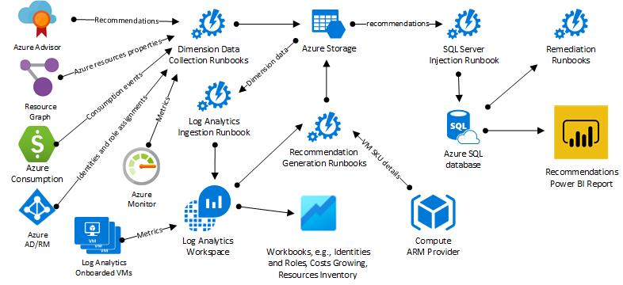

# 🔍 RAVLs Optimization Engine

This folder contains all the assets needed to deploy and manage the RAVLs Optimization Engine (ROE). ROE is an extensible solution designed to generate optimization recommendations for your Azure environment. To contribute to ROE, we recommend you to first deploy it in your environment, preferably in an Azure tenant in which you have all the required and optional permissions (see [requirements](#-requirements)).

On this page:

- [🏯 Architecture](#-architecture)
- [📋 Requirements](#-requirements)
- [➕ Deployment instructions](#-deployment-instructions)
- [🛫 Get started with ROE](#-get-started-with-roe)

## 🏯 Architecture

ROE runs mostly on top of Azure Automation and Log Analytics. The diagram below depicts the architectural components.



## 📋 Requirements

To deploy and test ROE in your development environment, you need to fulfill some tooling and Azure permissions requirements. See the [requirements guide](https://github.com/Ravl-io/ravl-opt-engine/requirements).

## ➕ Deployment instructions

The simplest, quickest and recommended method for installing ROE is by using the **Azure Cloud Shell** (PowerShell). See the [deployment instructions](https://github.com/Ravl-io/ravl-opt-engine/deployment). If you are working on a branch other than `main` and need to test the ROE deployment, use the following PowerShell instruction:

```powershell
.\Deploy-AzureOptimizationEngine.ps1 -TemplateUri "https://raw.githubusercontent.com/<GitHub user>/<repository>/<branch name>/src/optimization-engine/azuredeploy.bicep"

# Example:

.\Deploy-AzureOptimizationEngine.ps1 -TemplateUri "https://raw.githubusercontent.com/<GitHub user>/<repository>/<branch name>/src/optimization-engine/azuredeploy.bicep"
```

## 🛫 Get started with ROE

After deploying ROE, there are several ways for you to get started contributing:

1. Develop new Azure Workbooks or improve existing ones. ROE Workbooks are available from within the Log Analytics workspace chosen during installation (check the `Workbooks` blade inside the workspace). Check the Workbooks [code](./views/workbooks/) and [documentation](https://github.com/Ravl-io/ravl-opt-engine/reports).

1. Improve the built-in [Power BI report](./views/). See [documentation](https://github.com/Ravl-io/ravl-opt-engine/reports) for an understanding of all report pages.

1. Contribute with new optimization recommendations or improve existing ones (check the [Runbooks folder](./runbooks/)).
